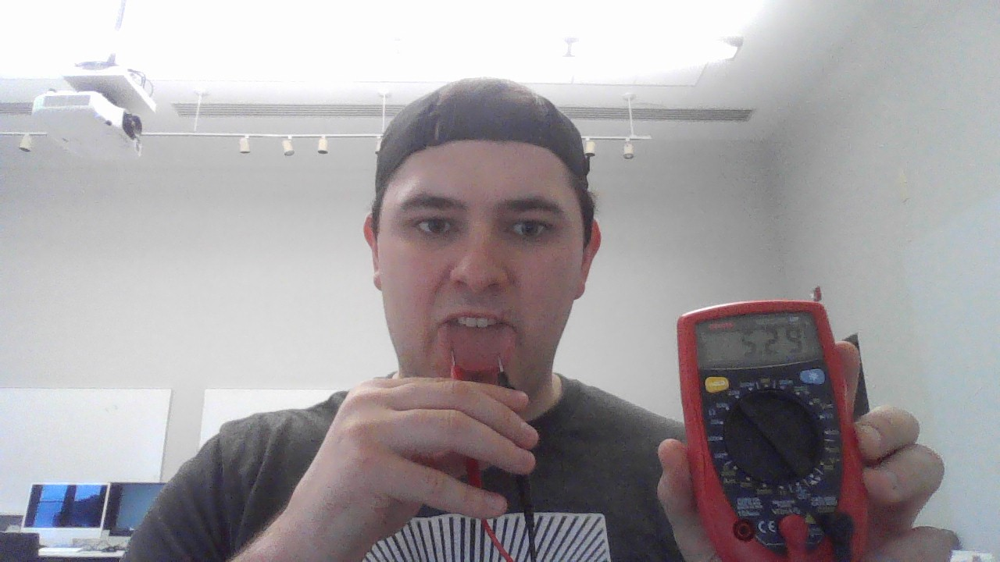
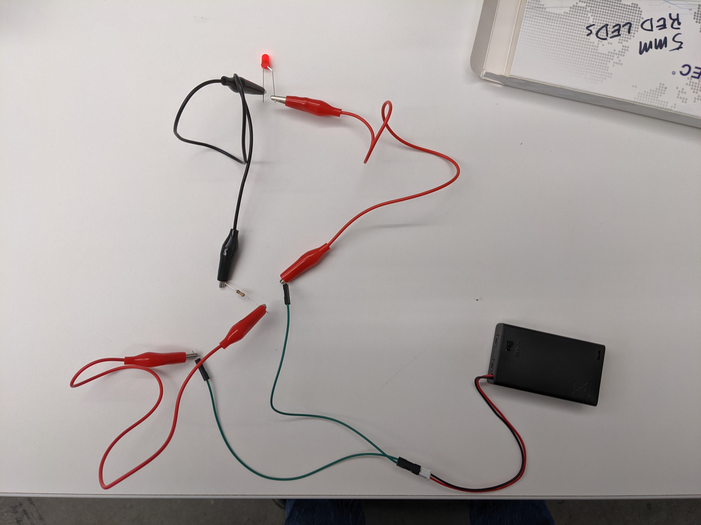
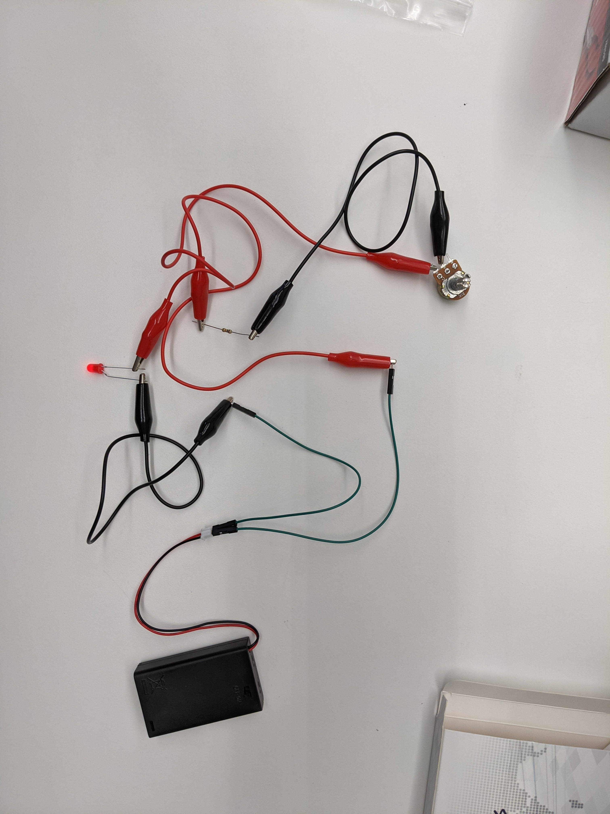

# dig333-devlog

#### Weeks: [1](#week-1) [2](#week-2) [3](#week-3) [4](#week-4) [5](#week-5) [6](#week-6) [7](#week-7) [8](#week-8) [9](#week-9) [10](#week-10) [11](#week-11) [12](#week-12) [13](#week-13) [14](#week-14) [15](#week-15)

<!--
BELOW IS A WEEKLY TEMPLATE. COPY/PASTE IT TO ADD A WEEK. SEE ASSIGNMENTS FOR DETAILS 
https://docs.google.com/document/d/1PAoPz-3vDPFWS5q9RHRb-dC7T4earpFXJW8w6v9wfZ0/edit
-->

## Week 1

### Context
  
- The TEDx presentation by Tom Igoe discusses how physical computing is the concept of computers tracking physical inputs from people.  He gives multiple examples such as a flight simulator where someone actually flaps his arms like wings and one where a tub of mud is used for input.  He also discusses the pros and cons of the open source physical computing community.
- "I wanna see a place where there is flow between these two different models." - Tom Igoe
    - Tom is referring to the model of big manufacturing and the model of open source schematic sharing.
- It is defeinitely encouraging to see communities being open to newcomers and everyone helping each other develop thei skills and products.
- Where should the line be drawn for what kind of schematics should be open source?

## Week 2

### Context

- The article "The Internet of Things: Roadmap to a Connected World" by Sanjay Sarma discusses how quickly the number of interconnected devices across the world has grown.  Sanjay believes that in order to have better structure for all these devices there must be an "agreement on system architecture", "development on open standards reflecting the best architectural choices", and the "creation of a 'test bed'".  The article "The Internet of Things has a dirty little secret: it's not really yours" by Internet of Shit discusses the grim modern reality of how every device is becoming a "smart" device that is connected to the internet.  Despite being supposedly "smart", these devices are usually less reliable and last for a shorter amount of time than their "dumb" counterparts.
- "What we really need from those building the Internet of Things is commitment." -Internet of Shit
- Both aurthors clearly have concerns with the current state of the Internet of Things, but they also are optimistic for the future.
- At what point will consumers begin to draw the line for what products they want connected to the internet?

### Experiments

<!-- List each Platt experiment / Monk recipe outcome, adding notes, photos, schematics, captions to show your work. -->

1. Taste the Power!
    1. 
    1. Lower resistance means a higher current
    1. Why does the current increase when the probes are farther apart.
1. Let's Abuse a Battery!
    1. Notes
        1. Flow of electicity per second is measured in amperes
        1. Pressure of elctricity that causes the flow is measured in volts
        1. Resistance to flow is measured in ohms
        1. A higher resitance restricst current
        1. A higher voltage is better able to overcome resistance
        1. Current from a battery is DC 
            1. DC current flows in one direction
        1. Current from wall outlets is AC current
            1. AC current has a pulsing flow
    1. The relationship of vlotage, resistance, and current
    1. Why did we not feel any heat on our tongue in the first experiemtn?
1. Your First Circuit
    1. Notes
        1. Resistors
            1. First two stripes are the digits
            1. Third stripe is what order of magnitude
            1. Fourth strip is tolerance, or accuracy
        1. LEDs
            1. forward voltage is the max voltage an LED can receive
            1. forward current is the max current that can pass through an LED
        1. 
    1. Learned the basics of setting up a circuit
    1. How could we make the LED brighter with only changing one thing?
1. Variable Resistance
    1. Notes
        1. A potentiometer works by having a wiper rub against a resistant material as it is turned
        1. Using one instead of a static resistor provides variable resistance which enables us to dim and brighten our LED 
        1. Potential difference is the voltage between two points
        1. 
        1. Ohm's Law: v = I x R
        1. Resistor's in series double resistance while resistors in parallel halve it
        1. watts = volts x amps    