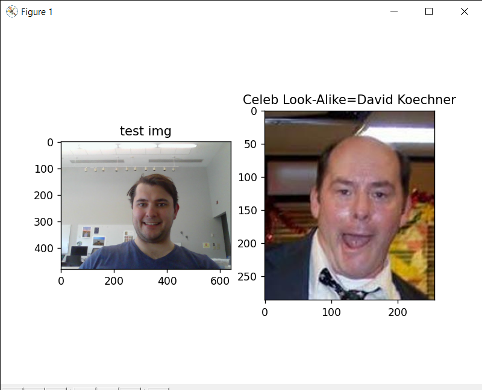

# Milestone 2: Able to Recognize Faces

## Plan
- [x] Be able to take picture from running python script
- [x] Able to pick out faces from picture

## Additonal Accomplishments
- [x] Can now find celebrity doppleganger from image

## Needed Fixes
- Program crashes if more than one face is detected

## Next Steps
- Using pan tilt, have camera follow face as you move

