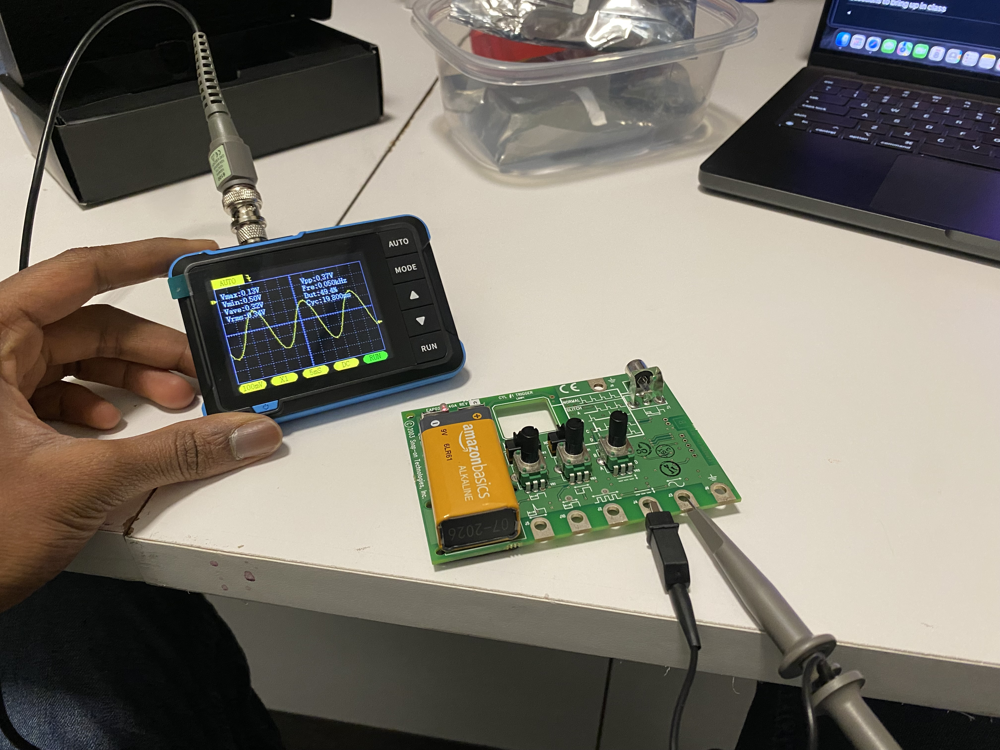

 [<](README.md)

# Week 03 - DevLog

## Outcomes 

<!-- 
Using the backslash preserves the list number 
https://stackoverflow.com/a/50916345/441878 
-->

1\. 📚 Read Chapter 03 - The Hello World Oscillator (39-45) in [Electronic music from scratch](https://www.makershed.com/products/make-electronic-music-pdf) (Pearson). Write a comment on one of Pearson's phrases that speaks to you. (2-3 sentences) 

- I liked how Mr. Pearson broke down how Piezos are constructed and the roles they perform in modern music making like, for example how he broke down the amplification of sound when you shake an orange juice carton the similarities it makes to the sound made by the ocean. I also enjoyed how he explained the use of electronics in modern music making towards the end of his chapter, like how he mentioned the splicing orchestra performances. 

2\. Follow instructions in "My First Square Wave Oscillator" experiment (Pearson 59-71) to create a breadboard oscillator. Share a photo.

- 

3\. Create at least one variation on your oscillator inspired by four variations on the circuit. Share a video of your your device.

- This is a google drive link to my video of the device. ( https://drive.google.com/drive/u/1/folders/1jOHKRfAD_nwKiU5CHPJtjxBuLJRYdkD5 )

4\. 📚 Read Chapter 4 - Amps, Reverbs, and Talkboxes (72-75) in [Electronic music from scratch](https://www.makershed.com/products/make-electronic-music-pdf) (Pearson).  

5\. Once you start listening you'll hear it everywhere. Share a link to a song that uses a synthesizer below.

- This video is from the Dune Sound Track by Hans Zimmer called A Time of Quiet Between the Storms. ( https://www.youtube.com/watch?v=igtwOdqboT0&list=RDigtwOdqboT0&start_radio=1 )

6\. Watch Synthesizer Basics: Amplitude, Oscillators, Timbre and describe
https://www.youtube.com/watch?v=c3udLCvoCC0 

- This video describes amplitude, envelope (enveloping sound), frequency and its relating to a pitch to a note, oscillators, filters and how they restrict frequencies allowed, timbre, modulation, and pitch modulation.  

7\. What is the difference between an analog and digital component?

- Analog signal is a continuous signal which represents physical measurements and digital signals are discrete time signals generated by digital modulation, denoted by square waves.

8\. [👉Activity: Analyze square waveforms with an oscilloscope](https://docs.google.com/presentation/d/1G4jdcr8KzWpIiIduQyFiQJEG-PFJHpovJb9rWhxhNYw/edit?slide=id.g3b8d920f8b7_0_49#slide=id.g3b8d920f8b7_0_49). On the Snap-on Waveform demo board, which pot controls variable voltage (duty cycle) and which controls variable frequency (PWM slides)? What is a common use of each? 

- The object labeled 13 on the schematic controlled the frequency of the wave, this oculd be used to increase the pitch of the sound produced. The object labeled 15 controlled the duty cycle (variable voltage) on the snap-on board. This can be used to change the width of the square wave form produced. 

9\. Post a photo of your Snapon board testing.

- 

10\. 🎬 Watch [Synthesizing with Moog - Lesson 3: Vibrations](https://www.youtube.com/watch?v=6VFJzY_GfJU) (14:33). How might you change your square wave to get a triangle wave?

- I learnt how affecting the width of a square wave affects the quality of sound produced. I saw that if you move the width forward, a slightly higher pitch is played and superimposed with the main key pitch, and similarly with the width moved backward, a sound with a slightly lower frequency is played and superimposed with the main key pitch. 

## Other experiments

<!-- 
Share details about other electronic experiments you are working on this week?
-->

- 

## Questions to bring up in class

<!-- 
Share questions you would like to bring up in class.
-->

- 
