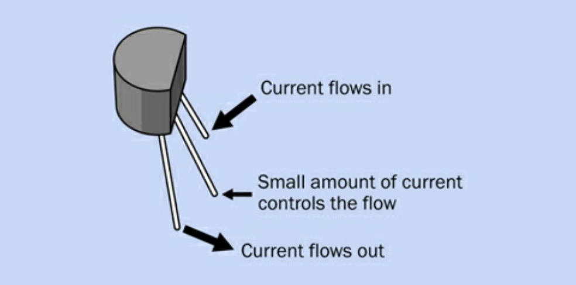

[<](README.md)

# Week 03

## Articles

Author, Article (year)
- Summary:
- Quote:
- Comment:
- Question:

## Experiments

### Platt 6: Very Simple Switching

#### Summary
- How to check continuity using a switch and a multimeter

#### Outcomes
- The continuity test looks like a diode and "sound alert".

 

#### Comments & Variations

This table shows some of the different types of switches covered in this chapter:

Abbr. | Name | ON/OFF | Example
--- | --- | --- | ---
SPST (1P1T) | single-pole, single-throw switch | on-off | Light switches in your house. Only connect circuit in one direction.
DPST (2P1T) | double-pole, single-throw switch | on-off | To control a 240-volt appliance in your house
SPDT (1P2T) | single-pole, double-throw switch | on-on | A basic on/off toggle switch
DPDT (2P2T) | double-pole, double-throw switch | on-on | Toggle switch with two poles, often used in AC power or to control a DC motor
SPST (1P1T) | single-pole, single-throw pushbutton | off-(on) | A  "momentary" switch that is (on only when held down), and flips back to off when released.

- **toggle**: the part of a switch that you flip with your finger
- **pole**: center terminal of a double-through (DT) switch
- **sparking**: when you make or break electrical contact

<small>Platt, Make: Electronics (p. 51)</small>

#### Questions
- Do you know where the term "audio jack" comes from? The inventor of the first electrical switch called it a "jack knife". The ubiquitous "jack switch" was used for many years in telephone operators, until it was replaced by relays (electrically operated switches) and finally, transistors.

[Goodbye to the Hello Girls: Automating the Telephone Exchange](https://www.sciencemuseum.org.uk/objects-and-stories/goodbye-hello-girls-automating-telephone-exchange) (2018)

### Platt 7: Investigating a Relay

<video width="640" height="480" controls>
    <source src="assets/video/20220221-relay-click.mp4" type="video/mp4">
    Your browser does not support the video tag.
</video>

#### Summary

Create a basic relay circuit.

#### Outcomes

Here are outcomes from the relays I had access to

- [`DS2E-SL2-DC5V`](https://www.digikey.com/en/products/detail/panasonic-electric-works/DS2E-SL2-DC5V/251838) DPDT "latching" relay with a 5V (12V?) coil appears to be dead ☠️
- [`JQ-SH-112LM`](https://html.alldatasheet.net/html-pdf/1145218/GOODSKY/JQ-SH-112LM/699/2/JQ-SH-112LM.html) SPST, Latched, 12VDC coil, made by Good Sky
- `LU-5-R` SPDT 5V - If you [simulate relays in Tinkercad the switch circuitry moves](https://www.tinkercad.com/things/0FwQG7Kjtmb) when you power the coil. 🙌
- [`JQC-T78-DC5V-C`](https://www.alibaba.com/product-detail/TF-JQC-T78-DC5V-C-5Pins_60673811835.html) (VAC 212)
- `G5SB-14` 5V coil by OMRON (see video above)

^ Schematic from DS2E-SL2-DC5V

#### Comments & Variations
-

#### Questions
-

### Platt 8: A Relay Oscillator

#### Summary
- Create an oscillator using a switch and a relay.

#### Outcomes

Platt has a great checklist for checking for faults:
1. Check voltages - Are there shorts?
1. Check placement - Make sure the circuit is actually a closed loop
1. Check component orientation - Diodes, capacitors, LEDs, etc.
1. Check connections - Look for issues with the connections in the breadboard
1. Check component values - Is your math right?
1. Check for damage - Are any components damaged?
1. Check yourself! - Take a break and come back when you are fresh

#### Comments & Variations
- I tried several capacitors with the G5SB-14 relay + 5V because I wanted to confirm that total capacitance of capacitors in parallel did indeed = the total of all of them.

See this [youtube video]() and [simulation on Tinkercad](https://www.tinkercad.com/things/e08cNkkNlyV)

1. capacitor(s) = 220μF x1
1. capacitor(s) = n/a
1. capacitor(s) = 47μF x1
1. capacitor(s) = 220μF x1
1. capacitor(s) = 220μF x2 (440μF)
1. capacitor(s) = 220μF x3 (660μF)
1. capacitor(s) = 220μF x4 (880μF)

#### Questions
- I wish there was an easier way to check voltage stored inside a capacitor. Oh, maybe the next exp..??

#### Notes about Farads

- One [farad](https://en.wikipedia.org/wiki/Farad) = the capacitance across which, when charged with one coulomb, there is a potential difference of one volt.
- The relationship between capacitance, charge, and potential difference is linear. If the potential difference across a capacitor is halved, the quantity of charge stored by that capacitor will also be halved.
- μ = micro; F = farad; μF = microfarad (1,000,000 of 1 Farad)

### Platt 9: Time and Capacitors

#### Summary
- Shows how to set up a circuit to charge a capacitor.
- An RC Network (R for resistor and C for capacitor)

#### Outcomes
- I created the circuit using a 100Ω resistor and 220 capacitor using 5V. It took 3 seconds to charge the cap to 5V.
- I updated the circuit with 2x 100Ω resistors (200 total). It took 6 (double) seconds to charge the capacitor.
- I also used Tinkercad and his exact measurements which took six seconds https://www.tinkercad.com/things/09pI6PVg8NF

> The speed with which a capacitor charges is measured with a function known as the “time constant” or T = R × C  (Platt, 77)

So
- T = R (in Ohms) × C (capacitance in F)
- T = 100Ω x 220μF "microfarads" [or (.00022 F "farads")](https://www.unitconverters.net/electrostatic-capacitance/microfarad-to-farad.htm)
- T = 100 / .00022 = or .022 seconds to get to 63%

Finally, Platt introduces the idea of a **coupling capacitor**:

> When a capacitor is positioned in a circuit to pass AC while blocking DC, we call it a coupling capacitor. It can allow a signal to travel from one part of a circuit to another, while blocking their DC voltages, which can be completely different. (Platt, 84)

- I like that it showed how to discharge a capacitor

### Platt 10: Transistor Switching

- The three leads of a bipolar NPN transistor are:
    1. **C**ollector - IN
    1. **B**ase - the middle lead; when it receives a small V (any amount more than E) it allows current to flow in through the collector and out the emitter
    1. **E**mitter - OUT
- In Experiment 10 Platt shows how to make a voltage divider, basically normalizing the values across the wiper of a pot. Pretty cool.
- See this in action https://www.tinkercad.com/things/g39rgzvVDZe
- An NPN transistor can be used as either a low-power "switch", or an amplifier.

> Transistors are easily damaged, and the damage will be permanent.
> 1. Don't apply power directly between any two pins of a transistor. You can burn it out with too much current.
> 2. Always limit the current flowing between the collector and the emitter with a resistor (like an LED).
> 3. Don’t apply voltage in reverse orientation. (Platt, 90)
