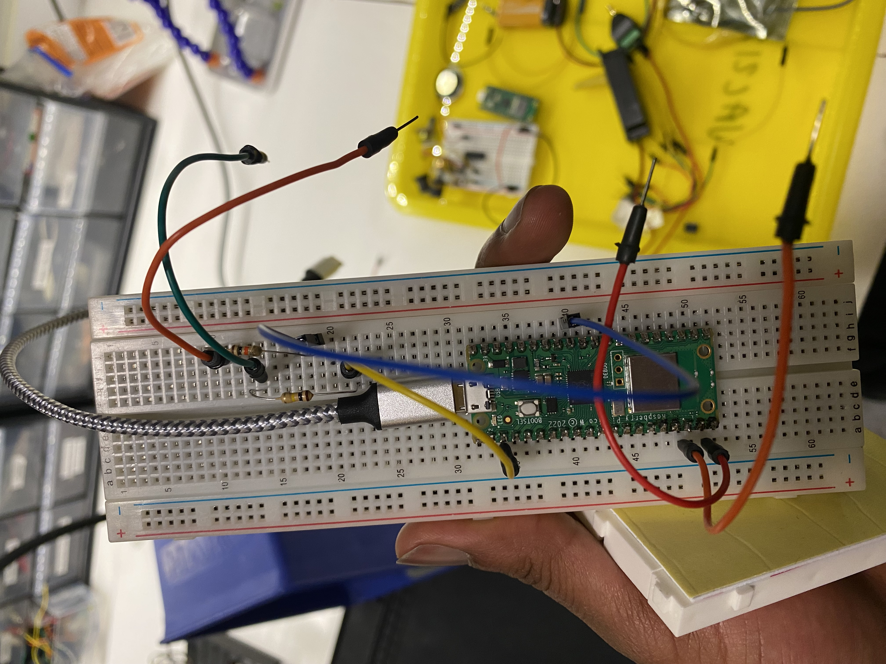

[<](README.md)

# Week 05 - DevLog


## Outcomes 

<!-- 
Using the backslash preserves the list number 
https://stackoverflow.com/a/50916345/441878 
-->


1\. 📚Read Chapter 5 (58-67) Physical Computing with Pico. Post documentation of your Traffic light controller
- I unfortunately did not take a picture of my setup for the traffic light controller but I have attached my python code below
  ```python
  import machine
  import utime

  led_red = machine.Pin(15, machine.Pin.OUT)
  led_yellow = machine.Pin(14, machine.Pin.OUT)
  led_green = machine.Pin(13, machine.Pin.OUT)


  m = 1

  while True:
    led_red.value(1)
    utime.sleep(5)
    led_yellow.value(1)
    utime.sleep(2)
    led_red.value(0)
    led_yellow.value(0)
    led_green.value(1)
    utime.sleep(5)
    led_green.value(0)
    led_yellow.value(1)
    utime.sleep(5)
    led_yellow.value(0)

  ```


2\. 📚Read Chapter 6 (68-79) Physical Computing with Pico. Post documentation of your Reaction Game
- I was also able to successfully run the reaction game on my pico. I did not take visual documentation of this but fortunately, I still have the python code used in the design.
  ```python
  import machine
  import utime
  import urandom
  
  led = machine.Pin(15, machine.Pin.OUT)
  button = machine.Pin(14, machine.Pin.IN)
  def button_handler(pin):
    button.irq(handler=None)
    print(pin)
  
  led.value(1)
  utime.sleep(urandom.uniform(5, 10))
  led.value(0)
  button.irq(trigger=machine.Pin.IRQ_RISING, handler=button_handler)
  ```


3\. Post documentation showing data from an analog sensor.
- With this I used the disc piezo, I connected it to my pico with my pico computer and pass audio to it register voltage changes. 


4\. 📚Read Brian Merchant [Everything That’s Inside Your iPhone](https://www.vice.com/en/article/everything-thats-inside-your-iphone/) Motherboard (2017). ✏️ Write a reflection below:

- I found it to be an incredibly interesting read. I did find checking the elemental composition of the iphone 6 and 5 to be a weird undertaking for a person. I did also sympathize with the mention of mining accidents that occured in the procuring of the elements.


5\. 📚Read Chapter 7 (80-91) Physical Computing with Pico. Post documentation of your Burglar Alarm.
- For this, I also review the instruction from the Physical Computing with Pico book but I was unable to design it because I did not find the HC-SR501 sensors. 


6\. 📚Read Chapter 8 (92-103 ) Physical Computing with Pico. Post documentation of your Temperature gauge.
- For this, I also reveiwed the instruction form the Physical Computing with Pico book and reviewed the code, implemented it onto my pico before proceeding to my musical instrument
```python
import machine
import utime

sensor_temp = machine.ADC(4)

conversion_factor = 3.3 / (65535)

while True:
  reading = sensor_temp.read_u16() * conversion_factor
  temperature = 27 - (reading - 0.706)/0.001721
  print(temperature)
  utime.sleep(2)
```


7\. Post documentation showing audio from your Pico
- I am currently unsure of what this prompt requires.

8\. Post documentation showing audio from your Pico
- I am currently unsure of what this prompt requires.

9\. Post documentation of your progress on the Musical Instrument
- I designed a looping frequency that changes by taking in voltages on the piezo and changed the outputted frequency on the piezo. 


10\. Post documentation of your progress on the Musical Instrument
- I sent the documentation with my questions on Slack 


## Other experiments

<!-- 
Share details about other electronic experiments you are working on this week?
-->

- 


## Questions to bring up in class

<!-- 
Share questions you would like to bring up in class.
-->

- 
